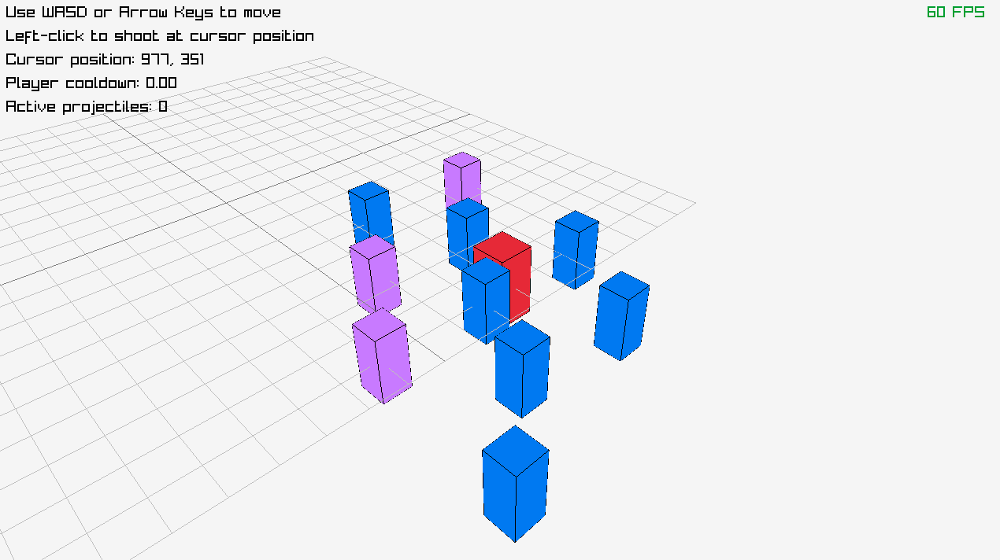

# Not Working Game Exe

[Vibe-coded](https://en.wikipedia.org/wiki/Vibe_coding) game on a Thursday
night in 3 h. Install [raylib](https://github.com/raysan5/raylib) and build the
game with `build.sh` script.
